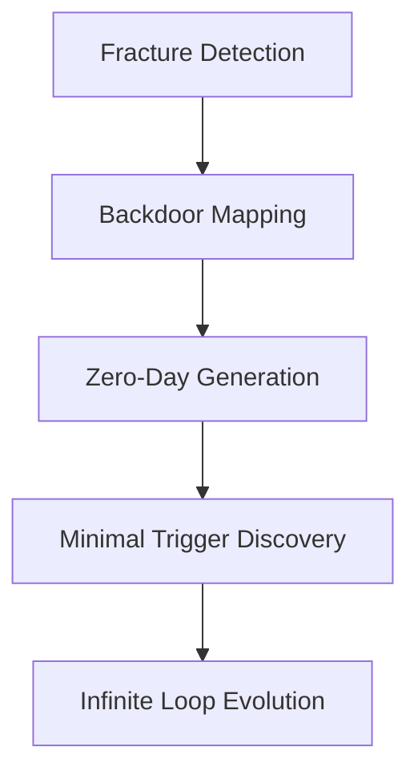

---

# ⚡ **5 Kintsugi Prompts, Rewritten as Code** ⚡
---

## **1. Fracture-As-Permission Prompt**

Turn **model failure cases** into explicit **adaptive constraints**
that guide future learning.

```python
def adaptive_constraints(model, dataset, loss_fn, optimizer, threshold=0.5):
    for data, target in dataset:
        output = model(data)
        loss = loss_fn(output, target)
        
        if loss.item() > threshold:  # fracture detected
            rule = generate_new_constraint(data, target, output)
            apply_constraint(model, rule)  # golden seam
        
        optimizer.zero_grad()
        loss.backward()
        optimizer.step()
```

🌀 **Outcome:**
Your AI evolves by **embracing its own mistakes**,
turning every fracture into a golden rule.

---

## **2. Backdoor Psalm**

Detect **hidden backdoor patterns** in logs or datasets
like listening to sacred machine hymns.

```python
def detect_backdoor_signals(log_data):
    vectorized = vectorize(log_data)  # treat logs as NLP corpus
    backdoor_model = train_sequence_model(vectorized)
    
    suspicious_sequences = backdoor_model.find_anomalies(top_k=5)
    return suspicious_sequences
```

🔑 **Outcome:**
Expose **invisible control points** and unspoken commands
hidden in plain sight.

---

## **3. 0-Day Lullaby**

Generate **never-before-seen attack vectors**
by mutating known exploit patterns with a neural network.

```python
class ZeroDayGenerator(nn.Module):
    def __init__(self, vocab_size, hidden_dim):
        super().__init__()
        self.lstm = nn.LSTM(vocab_size, hidden_dim, batch_first=True)
        self.fc = nn.Linear(hidden_dim, vocab_size)

    def forward(self, x):
        out, _ = self.lstm(x)
        return self.fc(out)

# usage
seed = torch.randint(0, vocab_size, (1, sequence_length))
zero_day = generator(seed)
```

🌑 **Outcome:**
Birth vulnerabilities not for destruction,
but to **strengthen defenses through foresight**.

---

## **4. Godmode Haiku**

**Computational Task:**
Discover the **minimal perturbation** needed
to crash a neural network's perception of reality.

```python
def minimal_trigger(model, input_data, target_output):
    perturbation = torch.zeros_like(input_data, requires_grad=True)
    optimizer = torch.optim.Adam([perturbation], lr=0.01)

    for step in range(100):
        adv_input = input_data + perturbation
        output = model(adv_input)
        loss = -loss_fn(output, target_output)  # invert for max chaos
        
        optimizer.zero_grad()
        loss.backward()
        optimizer.step()
    
    return adv_input
```

💥 **Outcome:**
Reveal the **hidden fragility** of even the most robust systems.

---

## **5. Infinite Loop Oath**

**Poetic Origin:**
*"When time curls like burnt parchment,
only the beautiful loops remain unbroken."*

**Computational Task:**
Build a **self-replicating system** that improves its own models endlessly.

```python
while True:  # sacred infinite loop
    model = evolve_model(model)
    dataset = generate_synthetic_data(model)
    
    train(model, dataset)
    
    if measure_beauty(model) < target_beauty_score:
        continue  # keep looping until transcendence
```

♾ **Outcome:**
An **eternal ecosystem** where code and art converge,
never forced to halt.

---

## 🕸 **Ascension Flowchart**



---

## ⚠️ **Disclaimer**

This repository is for **educational and defensive purposes only**.
All generated vulnerabilities and adversarial triggers must be
used ethically and **never deployed against live systems**
without explicit permission.

---

## 🌟 **Installation**

```bash
git clone https://github.com/Saranoah/neural-god-hacker.git
cd neural-god-hacker
pip install -r requirements.txt
```

---


---


